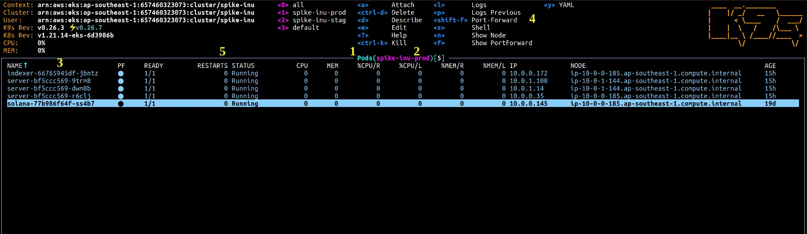
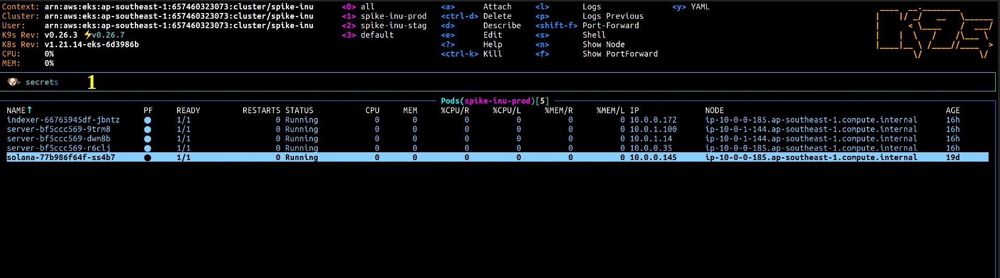

# K9s

## 1. Connect to cluster

- Install kubectl (kubenetes client): https://kubernetes.io/docs/tasks/tools/install-kubectl-macos/

  ```sh
  brew install kubectl
  ```

- Install AWS CLI (auth to connect to cluster): https://docs.aws.amazon.com/cli/latest/userguide/getting-started-install.html

  ```sh
  # macOS
  curl "https://awscli.amazonaws.com/AWSCLIV2.pkg" -o "AWSCLIV2.pkg"
  sudo installer -pkg AWSCLIV2.pkg -target /
  ```

- Add credentials
  - Get access key ID + secret access key: https://docs.aws.amazon.com/sdk-for-javascript/v2/developer-guide/getting-your-credentials.html
  - Make file ~/.aws/credentials

    ```sh
    nano ~/.aws/credentials
    ```

  - Add access key ID + secret access key to ~/.aws/credentials

    ```
    [default]
    aws_access_key_id = <key_id>
    aws_secret_access_key = <access_key>
    ```


- Install k9s

  ```sh
  brew install derailed/k9s/k9s
  ```

- Connect to cluster:

  ```
  k9s
  ```

## 2. Interactive with resource

### a. Describe resource



  - 1: Resource name. Example: namespace, pod, service, deployment, node, secret, ...
  - 2: Namespace. Example: dev, prod, stag, ...
  - 3: Resource list, container 
  - 4: List of command. You can use to view some info of resource. Example:
    - Type `l` to view log of pod
    - Type `p` to view log of previous pod
    - Type `ctrl + k` to delete pod, pod will be deleted và replace by new pod.
  - 5: Number of pod reboot. If the pod crashes due to an error or lack of memory (or CPU), the pod will restart and the number of restarts will increase by 1.

### b. Swich resource:
  
- Switch resouce by `:` (a small frame will show appear) and type resource name (example: `secret`) to switch to resource



- 1: Area to type resource name

### c. View secret (environment variable):

- Switch to secret
- Type `x` to view secret value
- Type `e` to edit secret
- Restart pod to apply new secret
  
### d. View log

- Switch to pod
- Move up/down to select pod to view log
- Type `l` to view pod's log
- Type `p` to view previous pod's log (view why the pod has to restart)

## 3. Add new service

- Repo `infrastructure`: Create new folder and add files `deployment.yml`, `service.yml`, `ingress.yml`, `kustomization.yml`
- Repo source code: Edit github action, control kustomize edit exactly repo
- ArgoCD: add new service 

## 4. Debugging

- Các trạng thái của pod (cột `STATUS`)
  - `Running`: đang chạy ổn định
  - `Running` (nhưng số lần restart > 0): pod vừa restart
  - `Error`: Pod gặp error và không thể start
  - `OOMKilled`: Thường là do leak memory, hoặc memory tăng bất thường dẫn đến thiếu memory

- Khi có service restart, sẽ có alert gửi đến channel trong discord (setting tron grafana). Để kiểm tra thông tin về lần restart đó:
  - Truy cập k9s
  - Switch to pod
  - Move up/down đến pod đã restart
  - Type `p` -> `0` đễ xem log trước khi restart

- Khi service không thê start:
  - Do code lỗi, không thể run được
  - Do thiếu resource
  - Do thay đổi config
